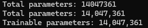
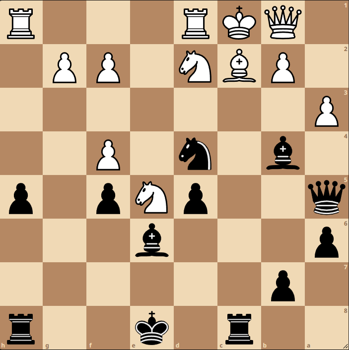
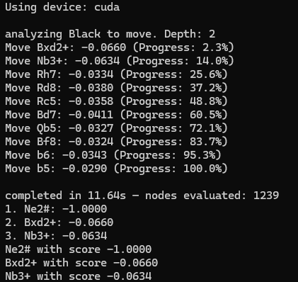
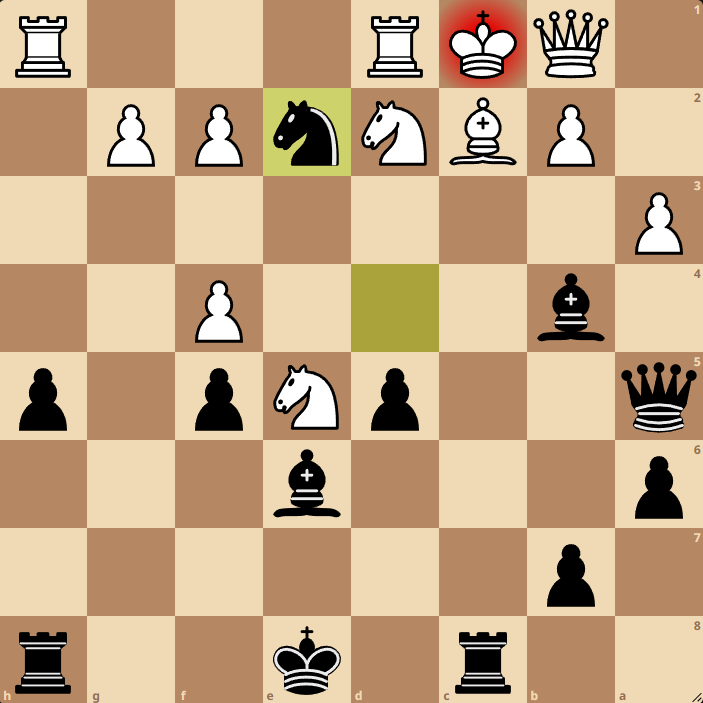

# Chess Transformer Engine

A PyTorch research project for evaluating chess positions with a compact
transformer encoder. Positions are encoded as 22 feature planes and trained
against game outcomes from PGN files.

This is not a Stockfish replacement. It is a neural evaluation experiment with
clean training and inference entry points, checkpoint support, and a small
alpha-beta search wrapper for move ranking.

## Highlights

- Transformer-based evaluator for `22 x 8 x 8` board tensors
- Shared feature extraction for training and inference
- PGN dataset indexing without loading every board into memory
- Checkpoint resume and best-model saving
- CLI-based inference from any FEN string
- Smoke tests for feature encoding and move search

## Model

The model embeds the chess board with two convolutional layers, flattens the
resulting `4 x 4` grid into 16 tokens, prepends a class token, and processes the
sequence with transformer encoder blocks. The output is trained as a
white-result score:

- `1.0`: White win
- `0.5`: Draw
- `0.0`: Black win



## Setup

```bash
python -m venv .venv
.venv\Scripts\activate
pip install -r requirements.txt
```

On Linux or macOS, activate with `source .venv/bin/activate`.

## Training

Large PGN files and checkpoints are intentionally ignored by Git. Put your PGN
files in the project folder or pass absolute paths.

```bash
python train.py lichess_db_standard_rated_2014-08.pgn ^
  --epochs 10 ^
  --batch-size 32 ^
  --learning-rate 1e-5 ^
  --checkpoint checkpoints/ultron.pth ^
  --best-checkpoint checkpoints/ultron_best.pth
```

Useful options:

- `--max-games-per-file`: limit indexing for quick experiments
- `--num-workers`: enable DataLoader workers
- `--device cpu|cuda|auto`: choose where training runs
- `--no-resume`: start fresh even if a checkpoint exists

## Inference

Run a search from a FEN position using a trained checkpoint:

```bash
python inference.py ^
  --checkpoint checkpoints/ultron_best.pth ^
  --fen "2r1k2r/1p6/p3b3/q2pNp1p/1b1n1P2/P7/1PBN1PP1/1QKR3R b k - 3 20" ^
  --depth 2 ^
  --top-k 3
```

If no checkpoint is supplied, the script still runs with random weights for a
smoke test, but the move rankings are not meaningful.

The old misspelled entry point, `infrence.py`, remains as a compatibility shim.
New scripts should use `inference.py`.

## Example: Smothered Mate

The repository includes a tactical example where Black can deliver a smothered
mate.



The expected move is `Ne2#`.





## Tests

```bash
pytest
```

The tests cover the board tensor contract and a lightweight inference smoke
path. They are designed to run without a PGN dataset or trained checkpoint.

## Repository Layout

```text
features.py     Shared board-to-tensor encoding
dataloader.py   PGN indexing dataset
model.py        Transformer evaluator
train.py        Training CLI
inference.py    Inference and search CLI
infrence.py     Backwards-compatible shim
tests/          Smoke tests
```

## Notes

Model strength depends on the quality and scale of the training data, training
time, checkpoint selection, and search depth. Treat reported tactical examples
as demonstrations, not as benchmark claims.
