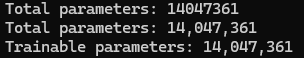

# **Chess Transformer Engine**
### A transformer-based chess engine trained on 2 million PGN games

## Overview

Modern chess engines are rapidly transitioning from convolutional neural networks (CNNs) to transformer-based architectures. This shift is exemplified by Leela Chess Zero's adoption of transformers, driven by fundamental architectural advantages for chess position evaluation.

## Why Transformers Over CNNs?

### Limitations of CNNs in Chess

CNNs process information through local convolution operations, which inherently limits their ability to capture global board patterns:

- **Local Pattern Recognition**: Even with deep networks and residual connections, CNNs primarily identify local piece configurations
- **Limited Spatial Awareness**: Understanding relationships between distant pieces requires information to propagate through numerous layers, creating a computational bottleneck
- **Sequential Information Flow**: Long-range tactical patterns suffer from the layered nature of convolutional processing

### Advantages of Transformers

Transformers revolutionize chess position evaluation through their self-attention mechanism:

- **Global Board Vision**: Every square can directly attend to every other square in a single layer, enabling immediate awareness of the entire position
- **Superior Long-Range Dependencies**: Chess tactics and strategies frequently involve distant piece coordination—transformers naturally excel at modeling these relationships
- **Parallel Processing**: Multi-head attention allows simultaneous evaluation of multiple strategic patterns

### The Trade-off

Transformers come with increased computational requirements:
- Higher memory consumption
- Greater processing power demands
- Larger training datasets needed

However, for competitive chess engines, these costs are justified by the substantial gains in positional understanding and tactical accuracy.

## Model Architecture

Our model utilizes the following configuration:

## Performance Test: Smothered Mate

We tested the model's tactical vision with a challenging position requiring precise calculation:

**The Critical Move**: Black to play and deliver checkmate in one move.

The position features a classic "smothered mate" pattern—a tactical motif that requires recognizing how the king's own pieces restrict its escape squares. The winning move is **Ne2#**, a knight check that delivers immediate checkmate.

### Results

Our model successfully identified the checkmate:

The model's ability to find this non-obvious tactical blow demonstrates its strong pattern recognition and evaluation capabilities, particularly for complex mating attacks.

## Training Details

- **Dataset**: 2 million chess games in PGN format
- **Architecture**: Transformer-based neural network
- **Task**: Move prediction and position evaluation

---

*This project demonstrates the practical application of transformer architectures to chess engine development, achieving strong tactical performance through modern deep learning techniques.*

